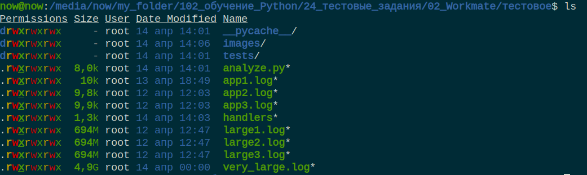

Приложение работает, выполнены все требования задания.

Для проверки работосопособности используются три предоставленных с заданием файла app1.log, app2.log, app3.log. Для тестирования больших логов испоьзуются три лог-файла размером 700мб и один лог-файл размером 5гб. Большие тестовые лог-файлы состоят из многократно скопированного app1.log.

Результаты работы на трех первоначальных файлах. Поскольку в предоставленных логах не было вариантов событий DEBUG, WARNING, CRITICAL, я добавил их в app1.log.

Результаты работы на трех крупных одинаковых файлах. 

Результат работы на одном из этих трех, для иллюстрации что время работы на трех примерно равна времени работы на одном - благодаря использованию многопроцессности.

Результат работы на файле размером 5гб.

Результ работы печатается в консоль и сохраняется в файл handlers. Так выглядит файл.

Приложение покрыто тестами, результат тестов по py-cov.

